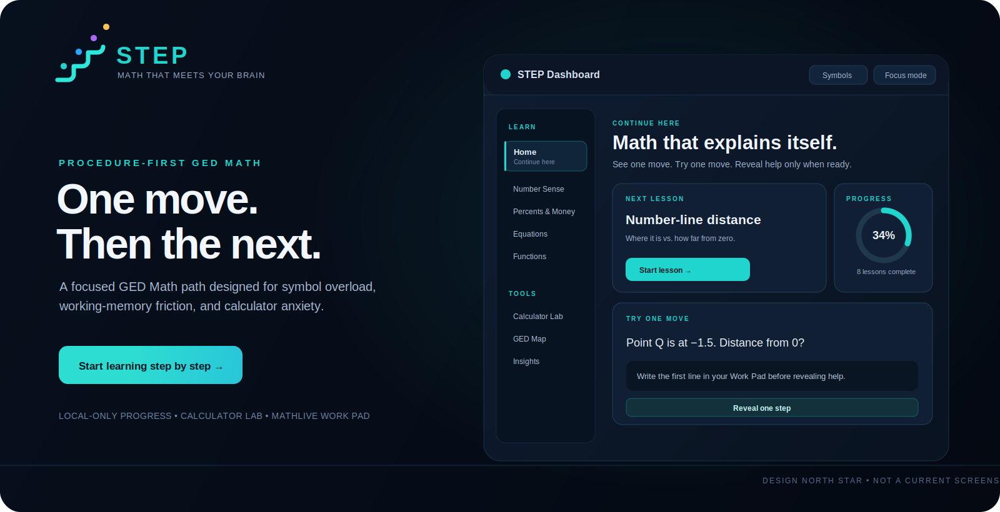
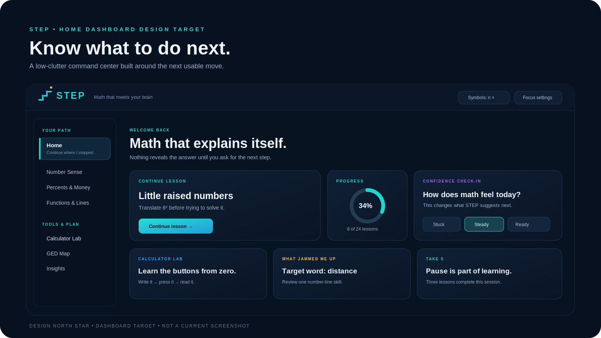
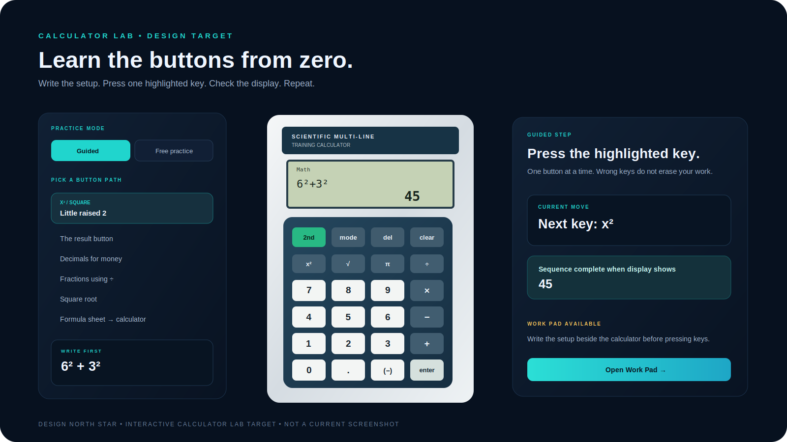
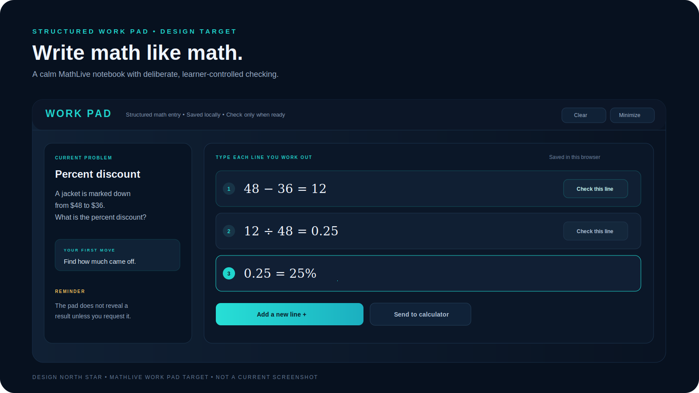
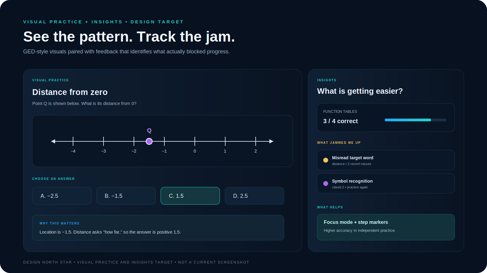

<div align="center">
  

# STEP

### Math that meets your brain.

**A procedure-first GED Math learning app for people who do not need more pressure — they need the missing steps made visible.**

[Live App](https://step.kodaxa.dev) · [Design North Star](#design-north-star) · [Learning Method](#how-step-teaches) · [Development Roadmap](#roadmap)

</div>

<br />



> **Design direction, not a current screenshot.** The concept boards in this README define the product experience STEP is moving toward. The live application already implements the core learning method, Calculator Lab foundations, MathLive Work Pad with deliberate checking, GED coverage mapping, progress tracking, and visual-practice infrastructure; final dashboard/layout convergence remains an active design target.

---

## Why STEP exists

Most GED Math resources assume the learner already knows how to start a problem, hold several steps in mind, interpret unfamiliar notation, and use the permitted calculator confidently.

STEP begins one layer earlier.

It is built for moments like:

- seeing `6² + 3²` and not having the raised `2` translated into `6 × 6` yet;
- locating a point at `−1.5` correctly, then losing the question because it asked for **distance** from zero;
- choosing the correct function table by instinct, but not knowing the repeatable rule that explains why;
- knowing a calculator is allowed, but not knowing what to press, in what order, or what the display should say;
- shutting down when an explanation introduces a result before showing where that number came from.

STEP's core belief is simple:

> **If a step is missing, the lesson failed — not the learner.**

---

## Current product status

STEP is a live, static web application deployed at **[step.kodaxa.dev](https://step.kodaxa.dev)**. It has no account system, no backend, and no cloud-stored learner history. Progress remains on the local device.

### Implemented today

| Area | Current capability |
| --- | --- |
| Procedure-first lessons | Guided examples and independent practice organized by GED skill family |
| Controlled reveal flow | Problems reveal working steps incrementally instead of exposing a solved page immediately |
| Learning notation | Uses `n` and `×` while learning, with GED notation available when useful |
| Calculator Lab | Interactive scientific-calculator practice surface with guided key paths and free practice |
| Calculator engine | Supports arithmetic, decimals, parentheses, squares, roots, powers, π, reciprocal, percent-style operations, answer recall, delete, clear, and enter |
| Structured Work Pad | MathLive-based typed math workspace with local saving, autofocus on open, and learner-triggered line checking |
| Reveal discipline | Work Pad results appear only after **Check** is pressed and clear immediately when the line is edited |
| Controlled answer choices | Immediate choice feedback is structurally restricted to lessons that intentionally teach answer-checking strategy |
| GED Map | Visible coverage map of ready, partial, and planned GED skill families |
| Practice-derived lessons | Dedicated instruction for number-line distance, raised-number/square recognition, and function-table rules |
| Visual practice foundation | Native number-line, coordinate-grid, and bar-chart rendering infrastructure |
| Insights foundation | Confidence and mistake-pattern tracking intended to show what helps and what jams |
| Accessibility and focus tools | Keyboard support, Work Pad autofocus, mobile navigation, reduced-motion handling, and focus settings |

### The reveal rule is enforced

Nothing in STEP should reveal a result before the learner deliberately requests it.

- The MathLive Work Pad stays quiet while a line is being written.
- Pressing **Check** evaluates only that line.
- Editing a checked line immediately removes the displayed result.
- Ordinary practice problems do not receive instant multiple-choice correctness feedback.
- Immediate answer-choice feedback exists only where checking answer choices is the procedure being taught.

---

## Design north star

STEP is being shaped into a calm, dark, high-clarity learning workspace: one dominant next action, low visual noise, and supporting tools available exactly when needed.

### Dashboard target



The dashboard target is not an analytics wall. It is a decision-reduction screen:

- one obvious lesson to continue;
- immediate access to Calculator Lab when tool uncertainty is the blocker;
- compact progress visibility;
- confidence check-in without shame framing;
- recent friction patterns shown in ordinary language;
- a visible pause reminder after sustained effort.

### Calculator Lab target



Calculator use is taught as its own skill, separate from math comprehension.

The target workflow is:

1. read one short problem;
2. write the calculation setup first;
3. press one highlighted key at a time on the emulator;
4. compare the display to the expected output;
5. repeat without guidance when the key path begins to feel familiar.

The emulator is being developed for GED-relevant TI-30XS MultiView-style practice. STEP does not use Texas Instruments branding, and exact physical key-position parity should be validated against the real device or an authoritative front-face reference before it is treated as muscle-memory training.

### Structured Work Pad target



The Work Pad is not a drawing surface. It is now a typed, structured MathLive notebook for writing one move per line:

```text
48 - 36 = 12
12 ÷ 48 = 0.25
0.25 = 25%
```

Already implemented:

- visual fractions, powers, roots, and equations through MathLive;
- one working line at a time;
- local-only saving;
- autofocus into the first math line when the pad opens;
- explicit **Check** action per line;
- checked results cleared the moment the line is edited.

The remaining work is visual convergence toward the full notebook-style board and tighter workflow connection with Calculator Lab.

### Visual practice and Insights target



GED Math is not only typed equations. STEP is expanding toward native, readable practice surfaces for:

- number lines;
- tables and function recognition;
- coordinate grids and graphing;
- charts and data displays;
- mixed-choice questions with deliberate feedback rules.

Insights are not intended to grade personality or intelligence. They exist to answer practical questions:

- Which procedure families are becoming reliable?
- Which target words or symbols repeatedly cause a miss?
- Does Focus mode, bigger text, or step marking improve independent practice accuracy?

---

## How STEP teaches

STEP is built around a small set of strict instructional rules.

### 1. Translate before solving

While learning, unfamiliar notation is rewritten into clearer working language.

| GED-style symbol | STEP learning translation |
| --- | --- |
| `3x + 7 = 25` | `3 × n + 7 = 25` |
| `6²` | `6 × 6` |
| `2/3 of 18` | `18 ÷ 3`, then `× 2` |
| point at `−1.5` | location is `−1.5`; distance from zero is `1.5` |

### 2. Show one usable move at a time

A STEP problem should not dump a completed solution before the learner has time to try. The flow is:

1. see the question;
2. identify or attempt the first move;
3. open Work Pad if needed;
4. reveal one step only when ready;
5. record what got in the way;
6. repeat the procedure independently.

### 3. Never introduce a mystery number

Every number in an explanation must visibly come from the line before it.

For example, an original-number problem should not suddenly say “40% of 70 is 28” before the learner sees why `70` was calculated and why the `28` is now being checked.

### 4. Separate understanding from calculator operation

The calculator does not replace the first move. It handles arithmetic after the setup is understood.

```text
Write first: 30 × 0.0825
Then type:   3 0 × 0 . 0 8 2 5 ENTER
Display:     2.475
Copy back:   tax = $2.48
```

### 5. Track friction, not failure

A wrong answer may come from very different causes:

- arithmetic slip;
- lost place;
- attention drift;
- forgotten formula;
- symbol not recognized;
- target word misread;
- method not yet understood.

STEP is designed to use those differences to recommend what to revisit next.

---

## Practice-derived development

STEP's lesson priorities are shaped by actual practice-session breakdowns rather than abstract textbook sequencing.

Examples already translated into course work:

| Practice pattern | What it revealed | STEP response |
| --- | --- | --- |
| `6² + 3²` missed | Raised-number notation was not automatic | Added **Little raised numbers and square roots** lesson and calculator drill |
| `Q = −1.5` selected instead of distance `1.5` | Location was read correctly; target word was missed | Added **Number lines: where it is versus how far** lesson |
| Function table selected correctly without knowing why | Recognition existed without a usable verbal rule | Added **Function tables: scan only x first** lesson |
| Calculator use limited to simple arithmetic | Tool operation blocks otherwise solvable questions | Elevated **Calculator Lab** into a first-class learning route |
| Solved results appeared before work was attempted | The interface could repeat the same shutdown trigger as ordinary resources | Shipped deliberate Work Pad checking and gated choice feedback |

---

## Learning path

### Core modules

| Module | Main purpose |
| --- | --- |
| Start Here | Translate symbols and define STEP's learning notation |
| Number Sense | Number lines, raised numbers, roots, decimals, negatives, and comparison |
| Percents & Money | Discounts, tax, percent increases, and original amounts |
| Equations | Undo operations without letting the letter `x` become a blocker |
| Ratios & Proportions | Recipes, pack costs, map scales, and unit reasoning |
| Rates | Speed and flow-style rate thinking |
| Fractions | Fractions of totals and rebuilding wholes |
| Geometry Formulas | Area, circles, right triangles, and cylinder volume |
| Systems | Combining two equations to remove one unknown |
| Slope | Rise over run from points and tables |
| Data & Averages | Mean, median, mode, range, and data displays |
| Probability | Fractions of a known group |
| Inequalities | Comparison statements and sign handling |
| Functions & Lines | Function tables first, then equations and graphs |
| Quadratics | Recognition and simple squared-variable procedures |

### Tools and readiness

| Tool path | Purpose |
| --- | --- |
| Calculator Lab | Learn calculator operation from zero through guided button sequences |
| GED Tools | Connect calculator use and formula-sheet procedures to problem families |
| GED Map | See which skill families are ready, partly built, or still planned |
| Work Pad | Enter structured math and check only the line you intentionally choose |
| Quick Help | Find compact “what to write” anchors |
| Insights | Review mastery and friction patterns |
| Readiness Check | Mixed, untimed GED-style procedure identification |

---

## GED coverage strategy

STEP uses the public Get Sum Math GED Math study-guide structure as an external coverage and sequencing checklist. The instructional content, problem prompts, UI, interaction model, and analytics are independently developed for STEP.

Coverage is organized around real test-use pathways:

- **Fast confidence wins** — shorter procedures useful when starting feels heavy.
- **Calculator helps here** — understand the setup, then execute efficiently.
- **Formula sheet route** — locate formula, substitute values, calculate, label units.
- **No-calculator foundation** — compact paper moves needed for early calculator-restricted items.
- **Mixed GED skills** — identify which method a question requires.
- **Later / lower priority** — track gaps without letting rare items dominate the immediate learning path.

---

## AuDHD-friendly interface principles

STEP is designed for focus regulation, working-memory friction, and task paralysis rather than assuming every learner benefits from the same study interface.

Current principles include:

- one dominant action per screen;
- no timer pressure by default;
- optional larger text and reduced clutter;
- visible step anchors;
- short language and direct labels;
- answer reveal only by deliberate request;
- structured Work Pad available alongside problem work;
- Calculator Lab as a separate skill path;
- local-only progress data;
- keyboard and mobile navigation support;
- reduced-motion support.

---

## Technical overview

STEP is intentionally lightweight: it is a private-learning-friendly frontend application rather than a platform or account system.

| Layer | Technology / approach |
| --- | --- |
| Frontend | React + TypeScript + Vite |
| Styling | Component-focused CSS design system and dark STEP brand tokens |
| Math input | MathLive structured entry in Work Pad with deliberate line checking |
| Calculation support | CortexJS Compute Engine, invoked only by learner-triggered Work Pad checks |
| Calculator practice | Custom interactive calculator emulator and expression engine |
| Visual problems | Native SVG/React-rendered number-line, chart, and coordinate-grid primitives |
| Progress storage | Browser `localStorage` only |
| Hosting | Vercel deployment at `step.kodaxa.dev` |
| Backend / authentication | None by design |

### Local development

```bash
npm install
npm run dev
```

### Quality checks

```bash
npm run typecheck
npm test
npm run build
```

---

## Roadmap

### Current product hardening

- Complete TI-30XS MultiView key-position and secondary-function calibration against an authoritative device reference.
- Continue mobile, keyboard, and screen-reader review of Calculator Lab and Work Pad interaction.
- Use additional real practice-test sessions to find the next exact procedure or wording blocks.
- Verify that all future interactive problem types preserve the learner-requested reveal rule.

### Design convergence

- Rebuild the live dashboard to match the dashboard north-star board.
- Convert Calculator Lab into the full three-panel workstation target.
- Polish the Work Pad presentation toward the notebook board while preserving shipped opt-in checking behavior.
- Refactor lesson screens around a stronger one-active-step visual hierarchy.
- Expand Visual Practice and Insights toward the target board using real logged data only.

### Curriculum expansion

- Surface area and remaining formula-sheet families.
- Simple interest and weighted-average calculator workflows.
- Coordinate-grid and graph-line visual practice.
- Scientific notation, unit conversions, polynomial recognition, and lower-priority GED gaps.
- More authentic interaction patterns such as fill-in, dropdown, and deliberate multiple-choice strategy drills.

---

## Privacy and boundaries

- STEP stores progress and working state in the browser on the device being used.
- It does not require login, collect learner data through an app backend, or publish private scores.
- Resetting progress clears local browser state for the app.
- STEP is an independent study project and is **not affiliated with GED Testing Service**, Get Sum Math, or Texas Instruments.
- External GED resources are used only as public reference/checklist material; STEP's lesson content and learning design are original to this project.

---

<div align="center">
  

  **One move. Then the next.**

  [Open STEP](https://step.kodaxa.dev)
</div>
